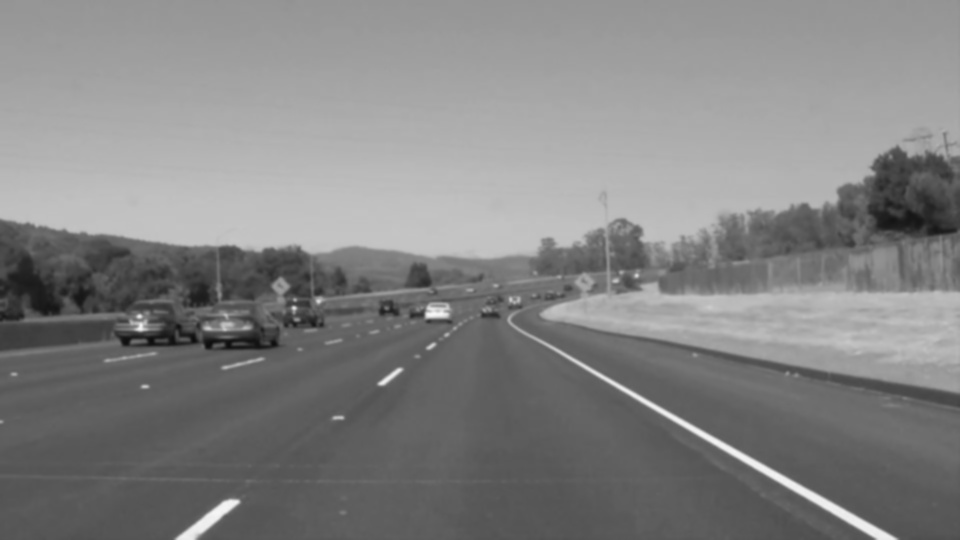
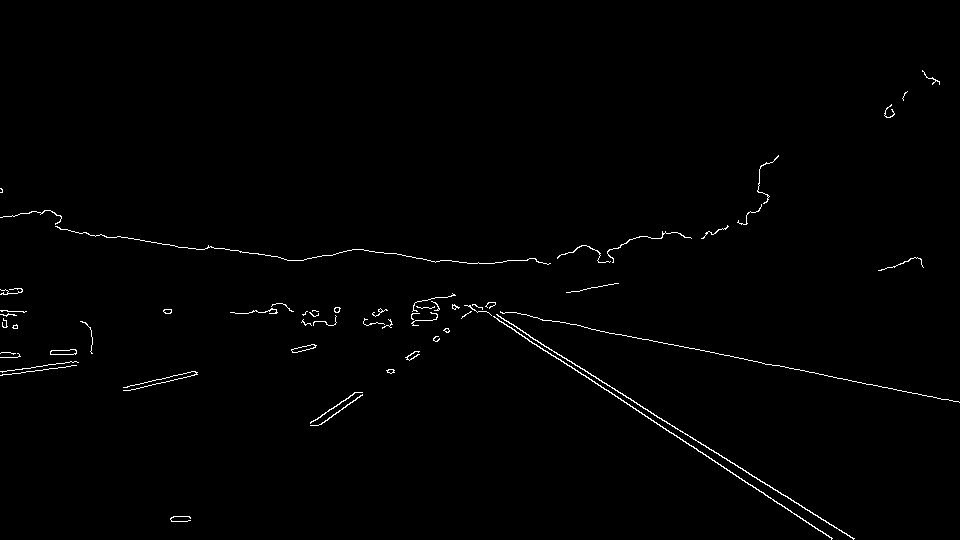
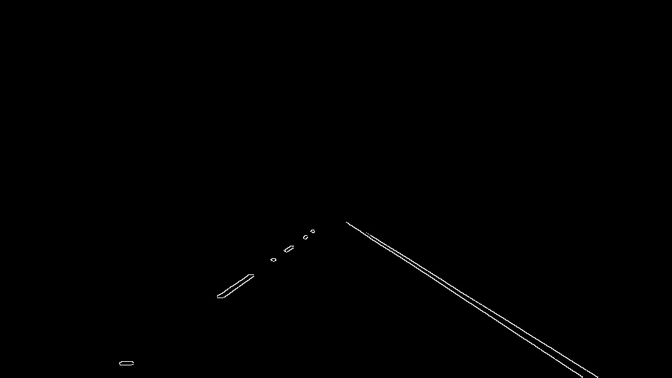
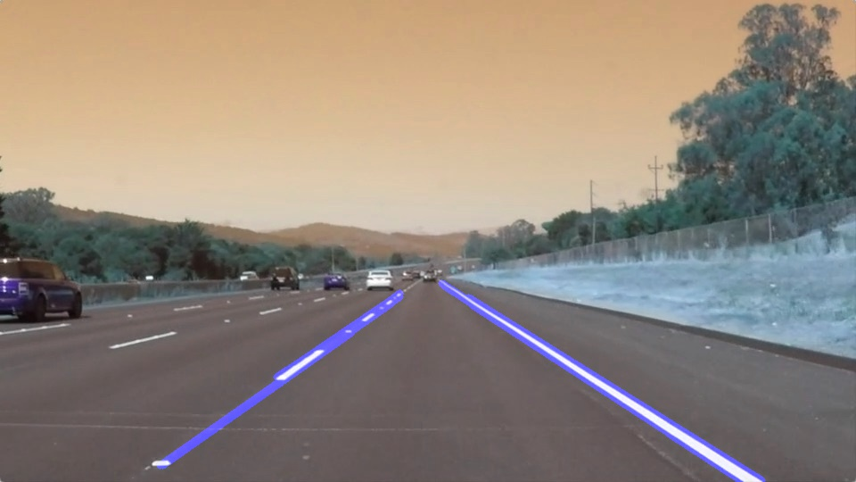

#**Finding Lane Lines on the Road** 

---

**Finding Lane Lines on the Road**

---

### Reflection

My pipeline consisted of 5 steps.

 1. First, I created copies of image and converted the copy of images to grayscale,

 
 
 2. Then, I applied gaussian blur on the images.
 3. On that image I applied Canny algorithm. with threshold 80:160, which complies with the 1:2 low:high ration suggested by canny.

 4. On that Image I identified my region of interest. Which identifies the road properly.

 5. Not it is time to add the hough transformation and find the road. Then ploat that road on the original image.

In order to draw a single line on the left and right lanes, I modified the draw_lines() function by trying to compute the mean of all the relevant x, y axises. But that exercise was futile. So I have increased the thickness to 7. In future iterations I will improve the draw_line to have a single straight line.

###2. Identify potential shortcomings with your current pipeline

I am yet to understand the complete science. Once that happens, I will be able to prepare the same pipeline for better results.

A possible shortcoming of the pipeline would be the inability to continuously track the striped lines, without adding an additional layer of correction. Also if there is anything in between these lines has lesser color difference from road, it will not be identified as a obstacle. Basing only on color and not on shapes and dimentions is also  a short coming.

###3. Suggest possible improvements to your pipeline

Multiple lines that are identified on a single image can be normalised to a single line on each side of road. Once I am clear about that algorithm I will be updating this with that.